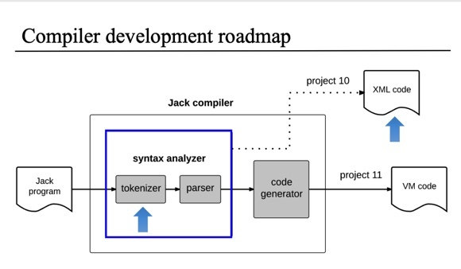

# Jack Compiler (Syntax Analyzer)



A syntax analyzer for the Jack programming language that converts `.jack` source files into XML parse trees.

## What It Does

Takes Jack source code (`.jack` files) and generates XML output files showing the parse tree structure. Output files are named `filenameOut.xml`.

## How It Works

1. **Tokenization**: Reads `.jack` file and breaks it into tokens (keywords, symbols, identifiers, constants)
2. **Parsing**: Uses recursive descent parsing to build the parse tree
3. **XML Generation**: Outputs the parse tree as formatted XML

**Usage:**
```bash
dotnet run --project JackCompiler/JackAnalyzer.csproj -- <input_path>
```

## Class Abstractions

### `IJackTokenizer` / `JackTokenizer`
**Abstraction**: Tokenizes Jack source code into lexical tokens
- Removes comments and whitespace
- Identifies keywords, symbols, identifiers, integer/string constants
- Provides token-by-token access via `Advance()`

### `ICompilationEngine` / `CompilationEngine`
**Abstraction**: Parses tokens into XML parse tree using recursive descent
- Implements Jack grammar rules (class, subroutine, statements, expressions)
- Generates XML tags for each language construct
- Manages token position during parsing

### `XmlOutputWriter`
**Abstraction**: Formats and writes XML output
- Handles XML escaping (`<`, `>`, `&`, `"`)
- Manages indentation for readable output
- Implements `IDisposable` for proper resource cleanup

### `JackAnalyzer` (Program)
**Abstraction**: Main entry point and file orchestration
- Processes single files or directories
- Coordinates tokenizer and compilation engine
- Generates output file paths

