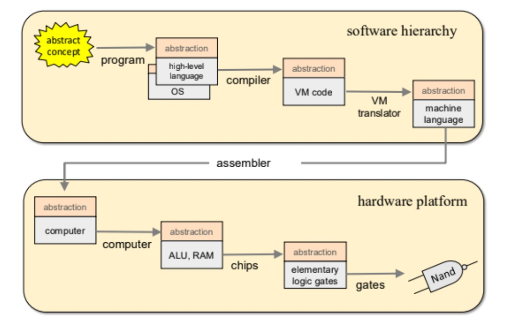

# 🧠 Nand2Tetris – From NAND Gate to Tetris

This repository contains all the **projects for Nand2Tetris courses**, where we build a modern computer system completely from the ground up — starting with basic logic gates and ending with a functional computer that can run Tetris.

---

## 📘 Course Hierarchy Overview

Below is the overall structure of the two Nand2Tetris courses — **Part I** and **Part II** — showing how each layer builds upon the one below.

  

---

## 🧩 Excalidraw Overview of All Projects (Part I)

You can explore the visual overview of all **Part I projects** using the Excalidraw link below:

🔗 [View Nand2Tetris Projects Overview (Excalidraw)](https://excalidraw.com/#json=8TtbrTjk4kEzwwl7J-jS-,1eUYaARbjlKye-6b6MKjSA)

---

## 📁 All Projects (Part II)

| Project | Description |
|---------|-------------|
| [Assembler](Assembler/) | Hack assembler that translates Hack assembly code into binary machine code |
| [VM_Translator](VM_Translator/) | Virtual Machine translator that converts VM commands into Hack Assembly code |
| [JackAnalyzer](JackAnalyzer/) | Syntax analyzer for Jack programming language that generates XML parse trees |
| [JackCompiler](JackCompiler/) | Full compiler for Jack programming language that translates Jack source code into VM code |
| [JackOS](JackOS/) | Operating System library for Jack programming language providing system services and utilities |

